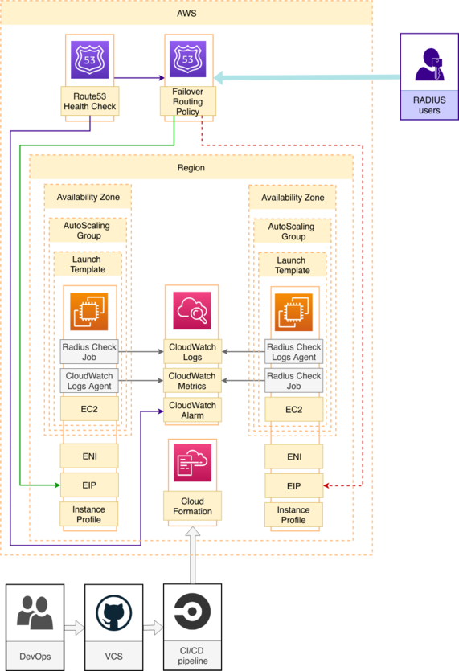

| Build status  | License |
| ------------- | ------------- |
|   |   |

## Task
Make FreeRADIUS installation highly available

## Solution
RADIUS uses UPD ports so LoadBalancer doesn't suite

Each instance has cron job that checks `radiusd` service status each minute and sends data to CloudWatch metric

If `radiusd` service on first instance is not active or no data was received CloudWatch alarm status will be changed from OK to ALARM

Route53 health check is listening to CloudWatch alarm and will become unhealthy as soon as CloudWatch alarm is

Traffic will be redirected to second instance by Route53 Failover Routing Policy until first instance is back

Both instances will be automatically replaced in case of termination by ASG and LaunchTemplate that uses cfn-init scripts to install FreeRADIUS

## Known issues and workarounds
1. Route53 Record set values are added in random order, this means that by default traffic could be sent to second instance

Temporary solution is to stop `radiusd` service on first instance, wait for alarm and than start service

This will make first instance default target for traffic

Permanent fix be Route53 Record Set should be removed from CloudFormation and implemented as CI step using either CLI or SDK

2. Route53 Traffic policy is more advanced than routing policy in record, but it's not available in CloudFormation

3. Solution doesn't configure FreeRADIUS, only installs it

## Production usage caution
This code is for demo purposes only and should never be used in production.
